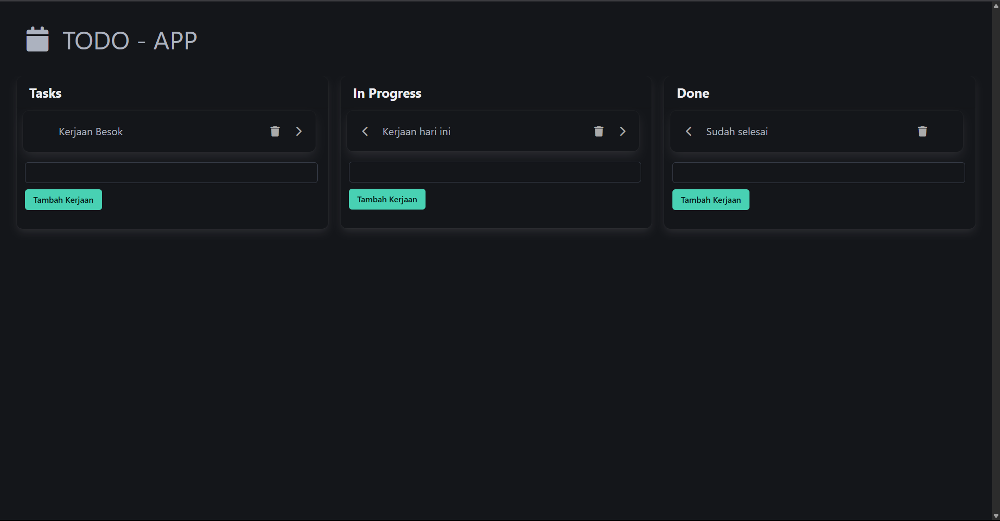
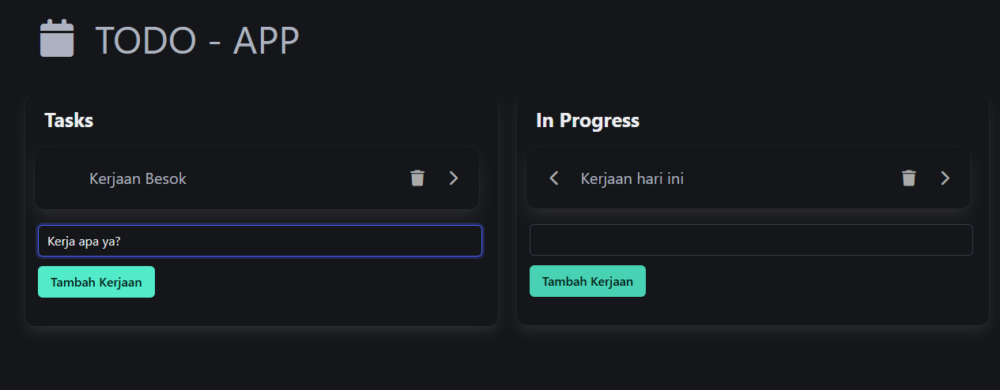
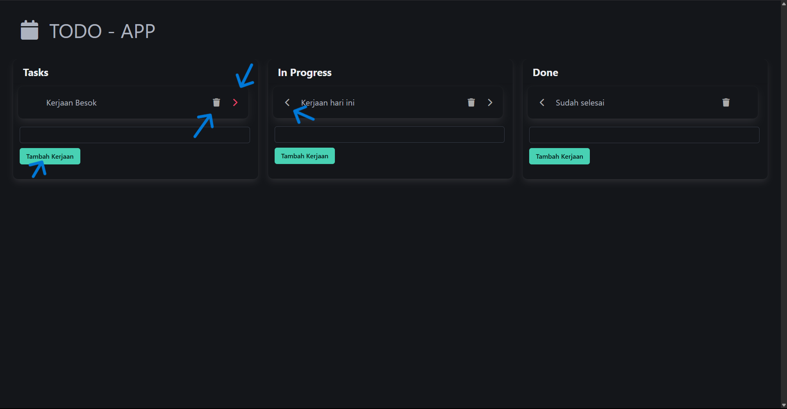
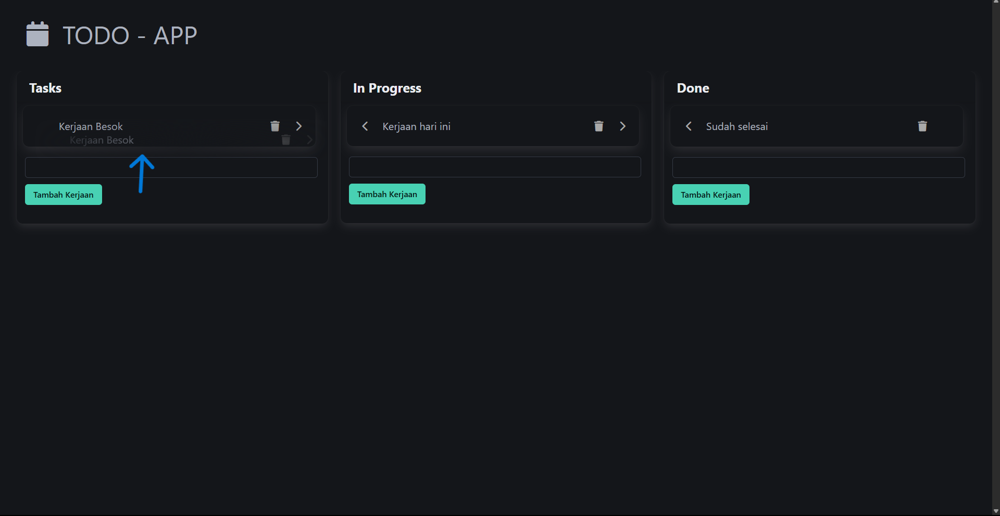
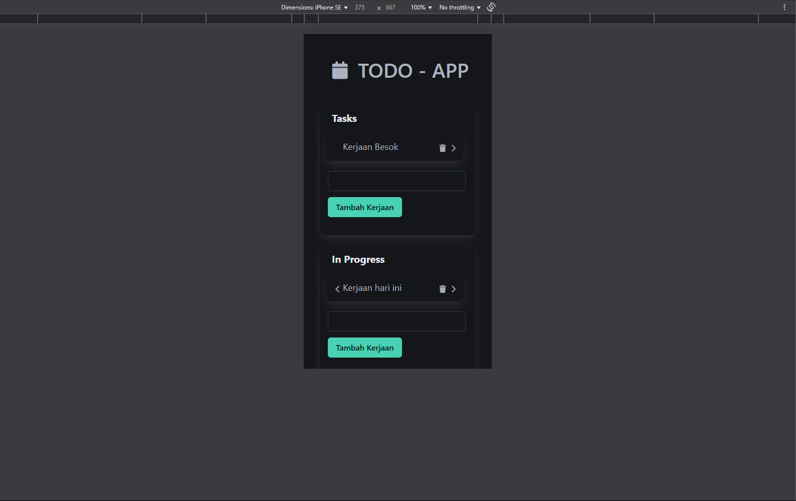
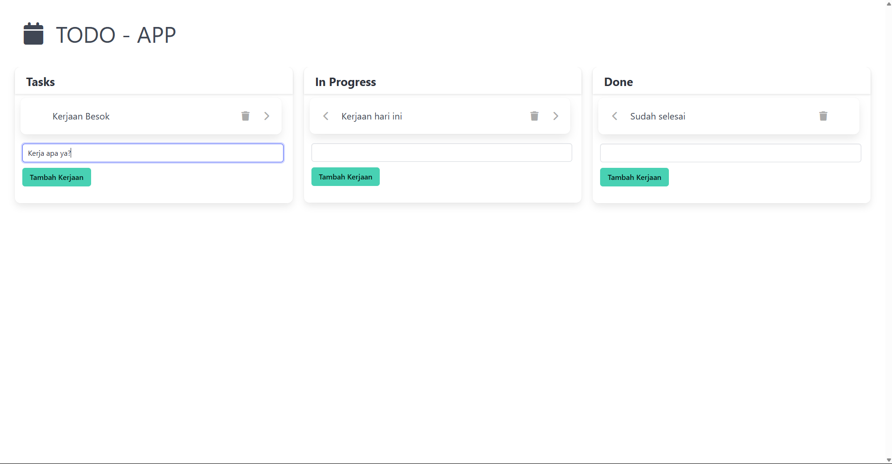

# TODO - APP (BULMA)

Selamat Datang di Dokumentasi Web saya.
TODO - APP (BULMA) Ini merupakan web yang memiliki fungsi untuk memudahkan kita dalam mengatur pekerjaan yang akan kita lalui agar
dapat lebih tersusun dan terjadwal. Web ini kedua saya buat dengan menggunakan framework Vite + Svelte dan Bulma.

## Framework yang digunakan

  

## Bahasa Pemrograman Yang di Gunakan

  

## Overview Web Ini

Web ini dibagi menjadi tiga segmen yaitu Tasks untuk pekerjaan yang akan kita kerjakan, In Progress untuk pekerjaan yang sedang kita lakukan,
dan Done untuk pekerjaan yang telah kita selesaikan.Kita dapat menambahkan pekerjaan baru dengan menuliskan pekerjaan di input textbox yang tersedia
dan menekan tombol tambah kerjaan untuk menambahkannya.

Setelah kita tambahkan ke Tasks kita dapat memindahkannya ke in progress ataupun done kalau pekerjaan kita sudah selesai.Kita dapat memindahkannya
dengan menggunakan tombol pindah samping.

Selain itu kita juga dapat memindahkannya kesamping dengan fitur drag & drop, canggih kan?

Jika misalnya kamu ingin hapus pekerjaan yang sudah tertera di joblist kamu, kamu bisa lo buat menghapusnya.Caranya adalah dengan menggunakan 
tombol trash yang ada disetiap list kerjaan yang ada.

Web ini juga dapat menyimpan semua joblist yang telah kamu tambahkan sehingga datanya tidak terhapus dan kamu dapat mengaksesnya ketika kamu membuka
web Todo - App ini.

Web ini sudah responsif sehingga tampilannya sudah bagus jika dibuka di smartphone maupun di dekstop.Selain itu, web ini bisa menyesuaikan temanya sesuai
tema dekstop kamu. bisa dark mode bisa light mode.

Penasaran? Kamu bisa tinjau langsung webnya [disini.](https://masyaaz.github.io/todo-app-bulma/)
